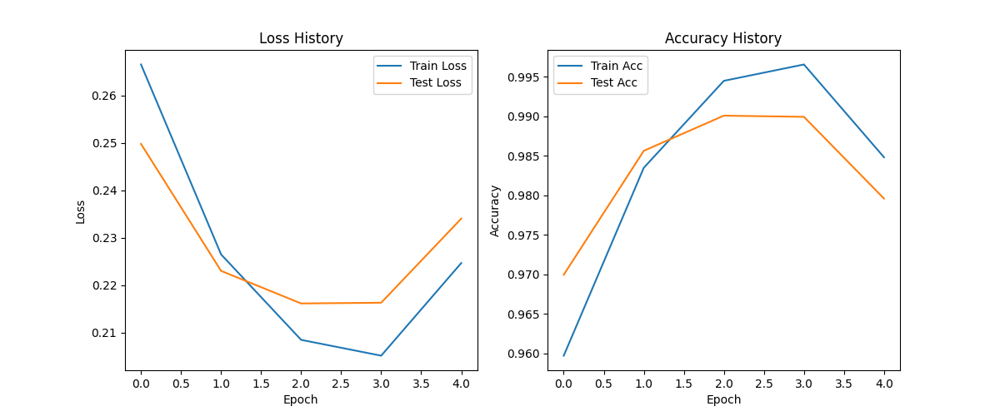
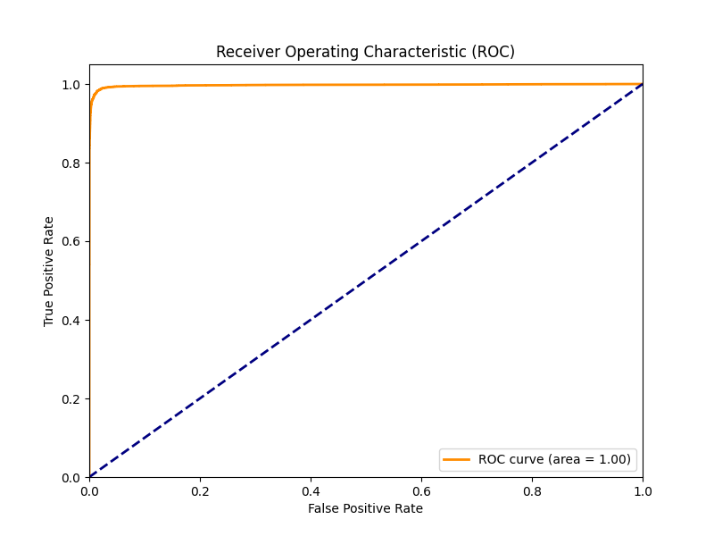
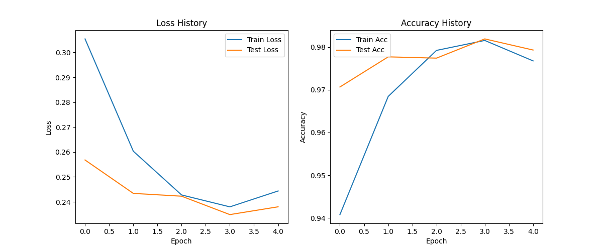
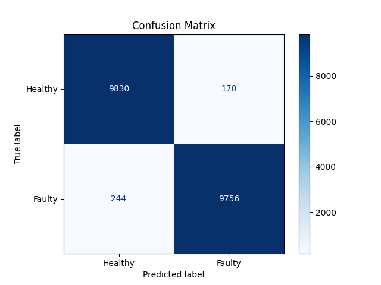
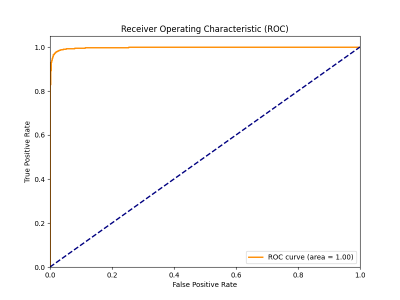
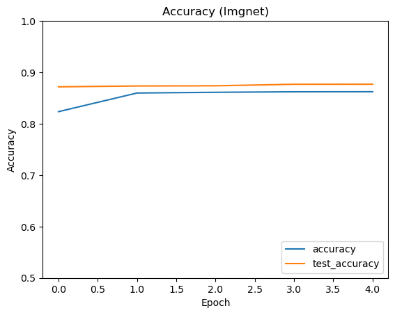
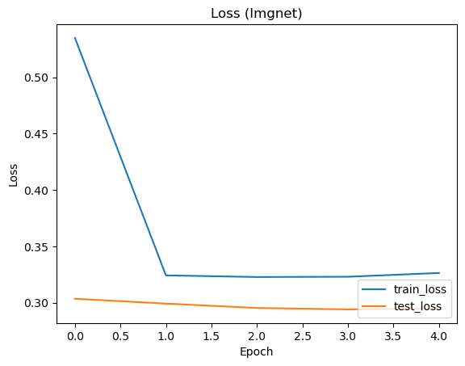
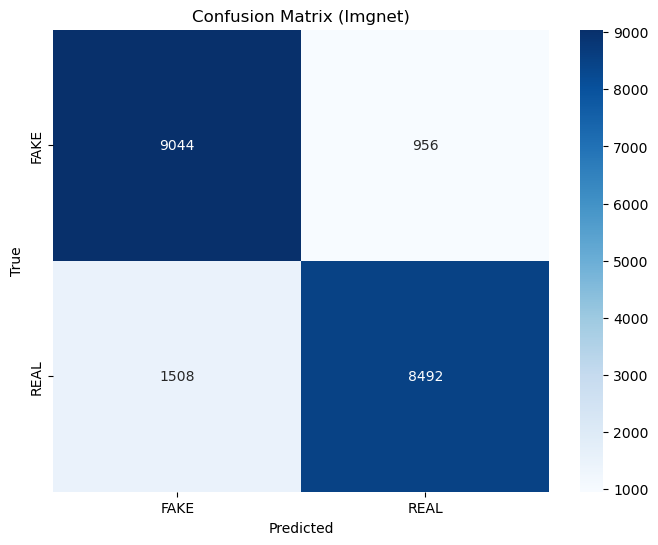
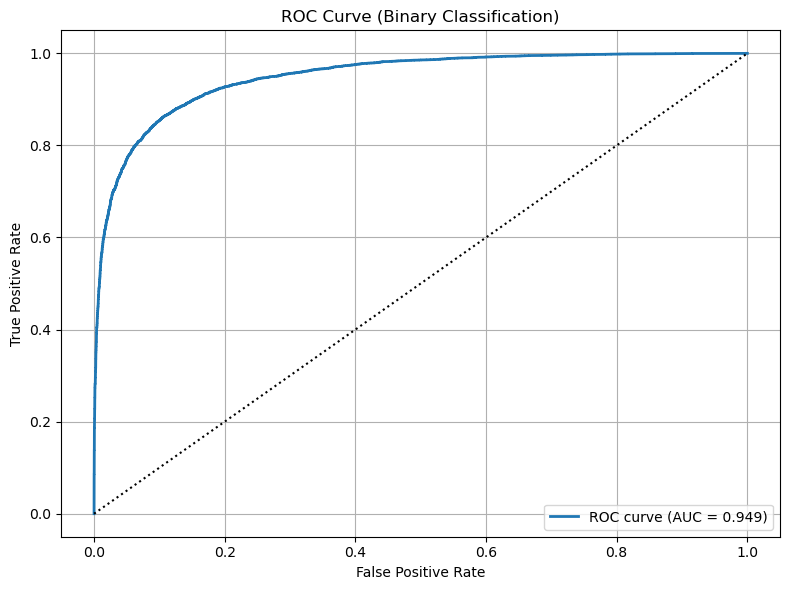

# AI-Generated Image Detection: ViT vs CNNs

## Project Overview

This project presents a comparative study of deep learning architectures for detecting AI-generated artwork. It evaluates the performance of **Vision Transformers (ViT-B/16)** against Convolutional Neural Networks (**ResNet18** and **MobileNetV2**) using the **CIFAKE** dataset (60,000 synthetic and 60,000 real images).

The goal is to identify the most effective model for distinguishing between human-created and AI-generated content, a critical task in the era of generative AI.

📄 **[Read the Full Project Report](4451_Project_Report.pdf)**

## Key Findings

Based on the experimental results:

- **ViT-B/16** achieved the **highest accuracy**, demonstrating the power of global attention mechanisms for this task.
- **ResNet18** performed exceptionally well, proving to be a strong and reliable alternative with near-identical performance to ViT.
- **MobileNetV2** traded some accuracy for speed, making it suitable for resource-constrained environments but less ideal for maximum detection capability.

## Repository Structure

- `vit.py`: Training and evaluation script for the Vision Transformer (ViT-B/16) model.
- `resnet18.py`: Training and evaluation script for the ResNet18 model.
- `imgnet.ipynb`: Notebook for additional analysis (MobileNetV2/ImageNet).
- `dataset_utils.py`: Utility script for downloading the CIFAKE dataset and creating data loaders.
- `Plots/`: Directory containing generated training graphs, confusion matrices, and ROC curves.

## Installation & Usage

### Prerequisites

Ensure you have Python installed along with the following dependencies:

```bash
pip install torch torchvision kagglehub matplotlib scikit-learn
```

### Running the Models

To train and evaluate the models, run the respective scripts:

**Vision Transformer (ViT):**

```bash
python vit.py
```

**ResNet18:**

```bash
python resnet18.py
```

_Note: The scripts will automatically download the CIFAKE dataset using `kagglehub` on the first run._

## Results & Analysis

### 1. Vision Transformer (ViT-B/16)

ViT demonstrated superior stability and top-tier accuracy.

**Training Performance:**

_(Loss and Accuracy over epochs)_

**Confusion Matrix:**

_(High True Positive and True Negative rates)_

**ROC Curve:**

_(AUC = 1.00 indicates near-perfect separation)_

---

### 2. ResNet18

ResNet18 showed robust performance, closely matching ViT.

**Training Performance:**


**Confusion Matrix:**


**ROC Curve:**


---

### 3. MobileNetV2 (ImageNet)

MobileNetV2 serves as the efficient, lightweight baseline.

**Training Performance:**



**Confusion Matrix:**


**ROC Curve:**

